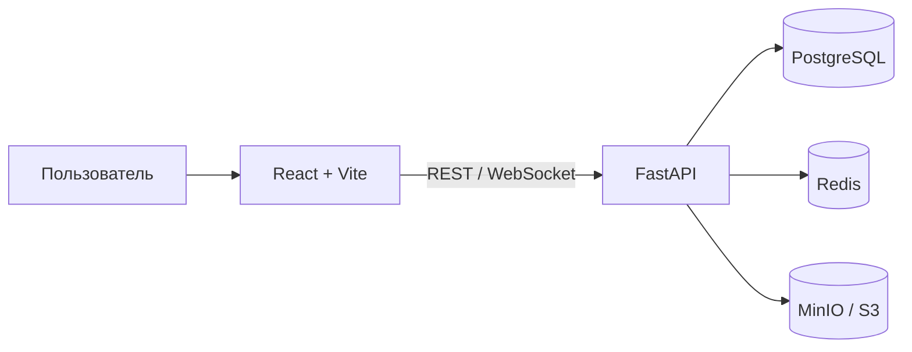

<div align="center">

# Memelution

### Социальная платформа для мемов, сообществ и общения

[](https://github.com/SheriAkhtamov/memelution/actions/workflows/ci.yml)
[](LICENSE)
[](https://www.python.org/)
[](https://react.dev/)

Memelution, или «Мемолюция», объединяет персональные ленты, публикации,
сообщества, обсуждения и личные сообщения в одном адаптивном веб-приложении.

</div>

> [!NOTE]
> Проект находится в активной разработке. Перед production-развёртыванием
> обязательно замените все секреты и dev-настройки из `.env.example`.

## Возможности

- персональные ленты: «Для вас», подписки, тренды, свежее и тематические подборки;
- текстовые публикации, мемы, видео, опросы, репосты и сохранённые записи;
- редактор мемов, загрузка нескольких медиафайлов и реакции;
- древовидные комментарии и реакции на комментарии;
- профили, подписки, сообщества, хэштеги и поиск;
- личные сообщения, ответы, реакции и уведомления в реальном времени;
- onboarding, локализация на русском, узбекском и английском языках;
- отдельная панель администратора для пользователей, жалоб и журналов;
- адаптивный интерфейс, тёмная тема и поддержка мобильных жестов.

## Технологии

| Слой | Стек |
| --- | --- |
| Frontend | React 19, TypeScript, Vite, TanStack Query, Zustand, Tailwind CSS |
| Backend | FastAPI, SQLAlchemy 2, Pydantic, Alembic |
| Данные | PostgreSQL, Redis, SQLite для локальной разработки |
| Медиа | Локальное хранилище или S3-compatible storage / MinIO |
| Инфраструктура | Docker Compose, Nginx, GitHub Actions |

## Архитектура



```text
.
├── backend/           # FastAPI API, модели, миграции, seed и тесты
├── frontend/          # React-приложение
├── deploy_panel/      # Веб-панель для развёртывания
├── nginx/             # Конфигурация Nginx
├── docker-compose.yml # Полный локальный стек
├── .env.example       # Шаблон переменных окружения
└── package.json       # Общие команды разработки
```

## Быстрый старт

### Docker Compose

Самый простой способ запустить весь стек:

```bash
cp .env.example .env
docker compose up --build
```

После первого запуска наполните базу демонстрационными данными:

```bash
docker compose exec backend python -m app.seed
```

Сервисы будут доступны по адресам:

| Сервис | Адрес |
| --- | --- |
| Приложение | http://localhost:5173 |
| API | http://localhost:8000 |
| Swagger UI | http://localhost:8000/docs |
| MinIO API | http://localhost:9000 |
| MinIO Console | http://localhost:9001 |

Остановить стек:

```bash
docker compose down
```

### Локальная разработка

Требования:

- Python 3.11+;
- Node.js 22+ и npm;
- запущенный Redis, если `ENABLE_REDIS=true`.

Создайте локальную конфигурацию:

```bash
cp .env.example .env
```

Для запуска backend на SQLite измените в `.env`:

```env
DATABASE_URL=sqlite+aiosqlite:///./memolution.db
ENABLE_REDIS=false
UPLOAD_DIR=./uploads
```

Подготовьте и запустите backend:

```bash
cd backend
python3 -m venv .venv
source .venv/bin/activate
pip install -r requirements-dev.txt
alembic upgrade head
python -m app.seed
uvicorn app.main:app --reload --host 0.0.0.0 --port 8000
```

В отдельном терминале запустите frontend:

```bash
cd frontend
npm ci
npm run dev
```

## Полезные команды

Команды из корня проекта:

```bash
npm run dev:backend       # Backend с hot reload
npm run dev:frontend      # Frontend с hot reload
npm run seed              # Демонстрационные данные
npm run test:backend      # Backend-тесты
npm run lint:frontend     # TypeScript typecheck
npm run build:frontend    # Production-сборка frontend
```

Проверки, которые выполняет CI:

```bash
cd backend && pytest
cd frontend && npm run lint && npm run build
```

## Конфигурация

Backend читает переменные из `.env` в корне проекта. Полный шаблон находится в
[`.env.example`](.env.example).

| Переменная | Назначение |
| --- | --- |
| `APP_URL`, `API_URL` | Публичные адреса frontend и backend |
| `DATABASE_URL`, `REDIS_URL` | Подключения к базе данных и Redis |
| `JWT_SECRET` | Секрет подписи JWT |
| `ENABLE_DEV_AUTH` | Упрощённый вход для локальной разработки |
| `TELEGRAM_*` | Настройки Telegram-аутентификации |
| `UPLOAD_DIR`, `MAX_UPLOAD_MB` | Локальное хранение и лимит медиа |
| `S3_*` | Настройки S3-compatible хранилища |
| `CORS_ORIGINS`, `RATE_LIMIT_*` | CORS и ограничение запросов |
| `POSTGRES_*`, `MINIO_ROOT_*` | Параметры сервисов Docker Compose |

## Миграции

```bash
cd backend
alembic upgrade head
```

Создать новую миграцию после изменения моделей:

```bash
alembic revision --autogenerate -m "describe change"
```

## Production checklist

- задайте сильные `JWT_SECRET`, `ADMIN_PASSWORD`, `POSTGRES_PASSWORD` и S3-секреты;
- выключите `ENABLE_DEV_AUTH` и `DEV_SEED_ON_STARTUP`;
- настройте реальные `APP_URL`, `API_URL`, `CORS_ORIGINS` и HTTPS;
- используйте PostgreSQL, Redis и S3-compatible storage с резервными копиями;
- настройте reverse proxy, мониторинг, логи и lifecycle policy для медиа.

## Лицензия

Проект распространяется по лицензии [MIT](LICENSE).
